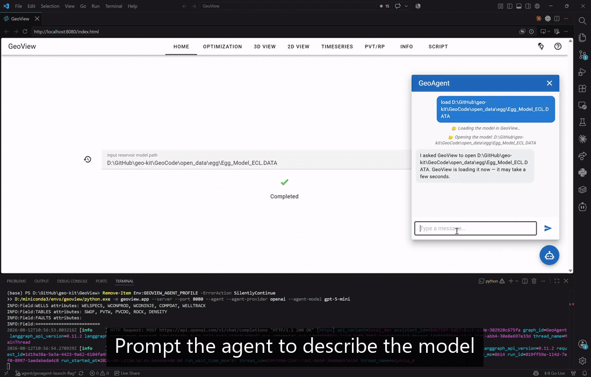

### 🌐 Multi-Language Support

**English** | [Русский](./translations/ru/README.md)

# GeoView

A web application for reservoir simulation, optimization, and visualization, powered by an AI agent.

Lightweight. Modern. Open source.



## Features

* **ECLIPSE Format Support:** Parsing of standard reservoir model files
* **Advanced Simulation:** Fast and reliable modelling using the JutulDarcy simulator
* **NPV Optimization:** Automated well schedule tuning to maximize discounted Net Present Value
* **Multi-Dimensional Visualization:** Rich interactive analytics for static and dynamic data (3D, 2D, and 1D)
* **AI-Assisted Workflows:** Autonomous AI agent to streamline engineering tasks and data analysis.


## Installation as a package

Create a new virtual environment with python 3.13 and install the project dependencies:

    pip install "git+https://github.com/geo-kit/geoview.git"

For reservoir simulation, install `Julia` from [https://julialang.org/downloads/](https://julialang.org/downloads/). Then install the JutulDarcy dependencies:
 >
 >     julia --project="$(python -c "import geocode, pathlib; print(pathlib.Path(geocode.__file__).parent / 'bin')")" -e "using Pkg; Pkg.instantiate()"

After installation, run in the terminal:

	geoview

This should open a new tab in your default browser to http://localhost:8080/ with the application's home page.

* **Contextual Help:** Click the help icon in the top-right corner for a brief description of the current page.
* **Tooltips:** Hover over any button or icon to see its description.

## Start parameters

You can add a few optional parameters to the application start command:
* --server to prevent a new tab from opening in the browser
* --app to launch the application in a separate window rather than in the browser
* --port 1234 to change the default port 8080 to, e.g., 1234
* --agent to start AI-agent
* -vr or --vtk_remote to enable vtk remote rendering instead of the default local rendering using vtk webassembly.

## Agent selection

When started with --agent flag, GeoView prompts the user to select an LLM provider and model. The available options are LM Studio, Ollama, Gemini, and OpenAI.

For a non-interactive launch, provide both values explicitly:

```powershell
python -m geoview.app --agent `
    --agent-provider ollama `
    --agent-model qwen2.5:7b
```

Use `--agent-base-url` for a non-default local or OpenAI-compatible endpoint:

```powershell
python -m geoview.app --agent `
    --agent-provider lmstudio `
    --agent-base-url http://127.0.0.1:1234/v1 `
    --agent-model some-model-id
```

The matching environment variables are `GEOVIEW_AGENT_PROVIDER`,
`GEOVIEW_AGENT_MODEL`, and `GEOVIEW_AGENT_BASE_URL`.

Cloud API keys are read from the environment (`OPENAI_API_KEY`). If a key is not
already set in the environment, GeoView loads it automatically from
`GeoAgent/.env`, so the simplest setup is to put the key there, one per line:

```
OPENAI_API_KEY=sk-...
```

The `--agent` launcher then picks it up without prompting, and the key is passed
only to the GeoAgent child process. GeoView does not start local model servers or
pull models.

The chat button appears on the Home tab. Ask about the model currently open (grid,
wells, phases, whether results exist), or ask the agent to find and open a model,
run the simulation, or fill in the optimization form.

## Installation from source code

Clone the repositories into the same directory:

	git clone https://github.com/geo-kit/geoview.git
	git clone https://github.com/geo-kit/geocode.git
	git clone https://github.com/geo-kit/geoagent.git

Install dependencies in `GeoCode` and `GeoView` repositories using

	pip install -r requirements.txt

For reservoir simulation, install `Julia` from [https://julialang.org/downloads/](https://julialang.org/downloads/). Then install the JutulDarcy dependencies:
 >
 >     julia --project=GeoCode/geocode/bin -e "using Pkg; Pkg.instantiate()"

Then navigate to the directory GeoView and run in the terminal

	python -m geoview.app

to start the application.


## Open-source reservoir models

An example reservoir model with dynamics simulation can be found in the `open_data` directory in the `GeoCode` repository [https://github.com/geo-kig/GeoCode](https://github.com/geo-kit/GeoCode),
as well as links to a number of other open source models.

## Next releases

The project is developing. We are preparing new releases with new features.
Your suggestions and issues reports will help to make the application even better.

## What's inside

We use
* [trame](https://github.com/Kitware/trame) to build the web application
* [GeoRead](https://github.com/geo-kit/GeoRead) to read and [GeoCode](https://github.com/geo-kit/GeoCode) to process reservoir models
* [JutulDarcy](https://github.com/sintefmath/JutulDarcy.jl) for reservoir simulation
* [GeoAgent](https://github.com/geo-kit/GeoAgent) for AI-agent assistance

## Citing

We hope that this project will help you in your research and you will decide to cite it as
```
GeoView web application (2026). GitHub repository, https://github.com/geo-kit/GeoView.
```
