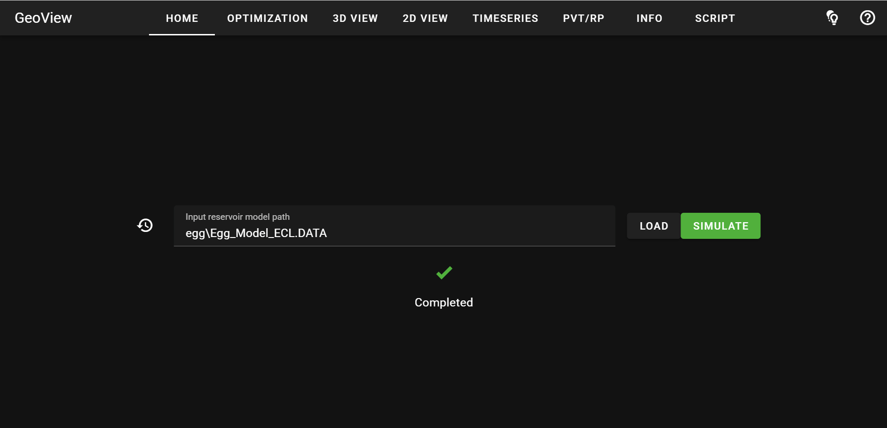

### 🌐 Multi-Language Support

**English** | [Русский](./translations/ru/README.md)

# GeoView

A web application for reservoir simulation, optimization, and visualization, powered by an AI agent.

Lightweight. Modern. Open source.


## Features

* **ECLIPSE Format Support:** Parsing of standard reservoir model files
* **Advanced Simulation:** Fast and reliable modelling using the JutulDarcy simulator
* **NPV Optimization:** Automated well schedule tuning to maximize discounted Net Present Value
* **Multi-Dimensional Visualization:** Rich interactive analytics for static and dynamic data (3D, 2D, and 1D)
* **AI-Assisted Workflows:** Autonomous AI agent to streamline engineering tasks and data analysis.



Main page of the application:


Simulated reservoir dynamics in 3D:


Filtering of grid cells and indication of well status (producing, injecting, inactive):


Selection of cells along well trajectories:


2D slice view:


Construction of a multiline 1D plot to compare dynamic properties:


Visualization of PVT and relative permeability tables:


Description of the reservoir model:


Script writing:


...and the results of its execution:


## Performance

Loading time and memory usage for benchmark models in the [benchmarks](./benchmarks) directory measured on a PC with Intel Core Ultra 7, 3.9GHz, 64Gb CPU:

| Number of cells | Loading time | Memory usage |
|-------|---------|---------|
| 1M | 23s | 0.5Gb |
| 10M | 3m 49s | 2.6Gb |
| 50M | 19m 26s | 10.3Gb |

## Requirements

| | Needed for | Note |
|---|---|---|
| Python 3.13 | everything | 3.11 and 3.12 also work; 3.13 is what we test |
| `git` on `PATH` | everything | GeoCode and GeoRead are installed from GitHub, not from PyPI |
| [Julia](https://julialang.org/downloads/) | reservoir simulation | only for the **Simulate** and **Optimize** buttons |
| [uv](https://docs.astral.sh/uv/) | the AI chat | GeoAgent runs in its own virtual environment, see [Enabling the chat](#enabling-the-chat-geoagent) |

## Installation as a package

Create a new virtual environment with python 3.13 and install the project dependencies:

    pip install "git+https://github.com/geo-kit/geoview.git"

This pulls GeoCode and GeoRead along with it. For reservoir simulation, install `Julia` from [https://julialang.org/downloads/](https://julialang.org/downloads/). Then install the JutulDarcy dependencies:
 >
 >     julia --project="$(python -c "import geocode, pathlib; print(pathlib.Path(geocode.__file__).parent / 'bin')")" -e "using Pkg; Pkg.instantiate()"

After installation, run in the terminal:

	geoview

This should open a new tab in your default browser to http://localhost:8080/ with the application's home page.

* **Contextual Help:** Click the help icon in the top-right corner for a brief description of the current page.
* **Tooltips:** Hover over any button or icon to see its description.

The AI chat needs one more step, since the agent is a separate process `pip` cannot place for
you: see [Enabling the chat](#enabling-the-chat-geoagent).

## Installation from source code

Clone both repositories into the same directory:

	git clone https://github.com/geo-kit/geoview.git
	git clone https://github.com/geo-kit/geocode.git

Install dependencies in `GeoCode` and `GeoView` using

	pip install -r requirements.txt

GeoRead is listed by GeoCode, so it arrives with it. For reservoir simulation, install `Julia` from [https://julialang.org/downloads/](https://julialang.org/downloads/). Then install the JutulDarcy dependencies:
 >
 >     julia --project=GeoCode/geocode/bin -e "using Pkg; Pkg.instantiate()"

Then navigate to the directory GeoView and run in the terminal

	python -m geoview.app

to start the application.

## Enabling the chat (GeoAgent)

The chat panel talks to [GeoAgent](https://github.com/geo-kit/GeoAgent), which GeoView starts
and stops for you. GeoAgent runs in its own virtual environment, so it needs its own checkout
whichever way you installed GeoView.

**1. Clone the agent.** Next to `GeoView/` if you installed from source — that is where GeoView
looks by default:

```
your-workspace/
├── GeoView/
└── GeoAgent/
```

	git clone https://github.com/geo-kit/GeoAgent.git

If you installed GeoView as a package, put it wherever you like and see step 5.

**2. Install it** with [uv](https://docs.astral.sh/uv/), from inside `GeoAgent/`:

	uv venv && uv pip install -e .

This creates the `.venv` that GeoView launches the agent from.

**3. Add your API key.** Copy `.env.example` to `.env` and fill in the key for the provider you
use, one per line:

```
OPENAI_API_KEY=sk-...
```

GeoView reads this file at startup and passes the value to the agent process only.

**4. Start GeoView with `--agent`:**

	geoview --agent --agent-provider openai --agent-model gpt-5-mini

The chat button appears on the Home tab. Ask about the model currently open (grid, wells,
phases, whether results exist), or ask the agent to find and open a model, run the simulation,
or fill in the optimization form.

**5. Package installs only — point GeoView at the checkout.** A packaged GeoView lives in
`site-packages` and has no sibling directory to look in, so give it the absolute path once:

```powershell
$env:GEOVIEW_AGENT_DIR = "C:\path\to\GeoAgent"
geoview --agent --agent-provider openai --agent-model gpt-5-mini
```

```bash
export GEOVIEW_AGENT_DIR=/path/to/GeoAgent
geoview --agent --agent-provider openai --agent-model gpt-5-mini
```

If GeoView exits with `GeoAgent langgraph executable was not found: ...`, step 2 has not been
run in that directory, or `GEOVIEW_AGENT_DIR` points somewhere else.

You do **not** need to set `GEOVIEW_RESULT_DIR`. GeoView passes it to the agent itself; it
matters only when you run the agent standalone, which GeoAgent's README covers.

## Start parameters

You can add a few optional parameters to the application start command:
* --server to prevent a new tab from opening in the browser
* --app to launch the application in a separate window rather than in the browser
* --port 1234 to change the default port 8080 to, e.g., 1234
* --agent to start AI-agent
* --ru to switch the chat to Russian
* -vr or --vtk_remote to enable vtk remote rendering instead of the default local rendering using vtk webassembly.

## Choosing the chat model

When started with the --agent flag, GeoView prompts for an LLM provider and model. The
available options are LM Studio, Ollama, and OpenAI.

For a non-interactive launch, provide both values explicitly:

```powershell
python -m geoview.app --agent `
    --agent-provider ollama `
    --agent-model qwen2.5:7b
```

Use `--agent-base-url` for a non-default local or OpenAI-compatible endpoint:

```powershell
python -m geoview.app --agent `
    --agent-provider lmstudio `
    --agent-base-url http://127.0.0.1:1234/v1 `
    --agent-model some-model-id
```

The matching environment variables are `GEOVIEW_AGENT_PROVIDER`,
`GEOVIEW_AGENT_MODEL`, and `GEOVIEW_AGENT_BASE_URL`.

Cloud API keys are read from the environment (`OPENAI_API_KEY`). If a key is not
already set there, GeoView loads it from `GeoAgent/.env`, which is why step 3 above is
enough. GeoView does not start local model servers or pull models.

## Rendering options

By default, rendering is performed locally in the user's browser using vtk webassembly functionality.
To enable vtk remote rendering, use the `-vr` or `--vtk_remote` option when starting the application.
Note that the functionality of the application is slightly different between local and remote rendering.

## Open-source reservoir models

An example reservoir model with dynamics simulation can be found in the `open_data` directory in the `GeoCode` repository [https://github.com/geo-kit/GeoCode](https://github.com/geo-kit/GeoCode),
as well as links to a number of other open source models.

## Script writing

The application allows you to write and execute python scripts for
reservoir model transformations and calculations. The script should
be based on the `GeoCode` framework
[https://github.com/geo-kit/GeoCode](https://github.com/geo-kit/GeoCode).
Read the [documentation](https://geo-kit.github.io/GeoCode/)
and see
[examples](https://github.com/geo-kit/GeoCode/tree/main/notebooks)
in the `GeoCode` repository to prepare a script.

## Next releases

The project is developing. We are preparing new releases with new features.
Your suggestions and issues reports will help to make the application even better.

## What's inside

We use
* [trame](https://github.com/Kitware/trame) to build the web application
* [GeoRead](https://github.com/geo-kit/GeoRead) to read and [GeoCode](https://github.com/geo-kit/GeoCode) to process reservoir models
* [JutulDarcy](https://github.com/sintefmath/JutulDarcy.jl) for reservoir simulation
* [GeoAgent](https://github.com/geo-kit/GeoAgent) for AI-agent assistance

## Citing

We hope that this project will help you in your research and you will decide to cite it as
```
GeoView web application (2026). GitHub repository, https://github.com/geo-kit/GeoView.
```
