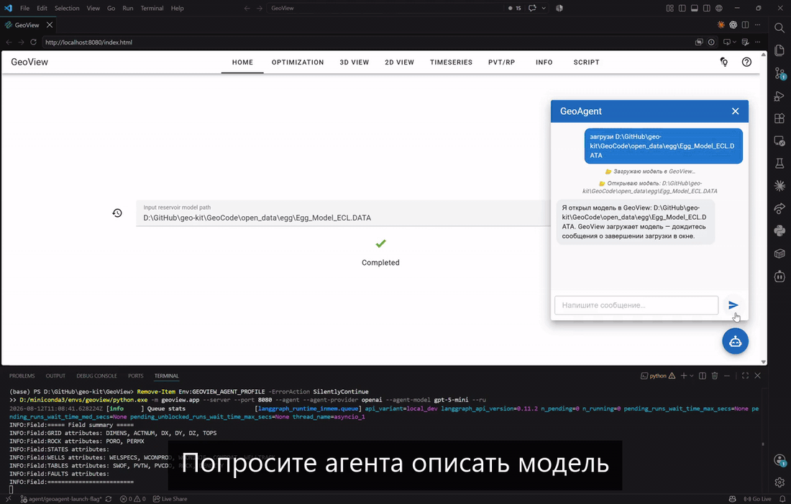

### 🌐 Языки

[English](../../README.md) | **Русский**

# GeoView

Веб-приложение для расчёта и наглядного представления моделей месторождений.

Лёгкое. Современное. С открытым исходным кодом.

## Возможности

Приложение позволяет:
* считывать модели месторождений, заданные в формате файлов ECLIPSE;
* проводить расчёт моделей с помощью расчётного модуля JutulDarcy;
* просматривать и изучать статические и динамические данные в трёхмерном, двумерном и одномерном виде;
* выгружать результаты расчёта в форматах ECLIPSE и CSV;
* писать и выполнять собственные сценарии на языке python для преобразований и расчётов по модели;
* работает как на своём компьютере, так и на удалённом сервере.

Главная страница приложения:


Рассчитанная модель месторождения в трёхмерном виде:


Фильтр ячеек сетки и обозначение состояния скважин (добывающая, нагнетательная, бездействующая):


Выделение ячеек вдоль стволов скважин:


Просмотр двумерного среза:


Построение совмещённого графика для сравнения динамических свойств:


Отображение таблиц PVT и относительных фазовых проницаемостей:


Описание модели месторождения:


Написание сценария:


...и результаты его выполнения:


## Быстродействие

Время загрузки и расход памяти для эталонных моделей из каталога [benchmarks](../../benchmarks), измеренные на компьютере с процессором Intel Core Ultra 7, 3.9 ГГц, 64 ГБ оперативной памяти:

| Число ячеек | Время загрузки | Расход памяти |
|-------|---------|---------|
| 1 млн | 23 с | 0,5 ГБ |
| 10 млн | 3 мин 49 с | 2,6 ГБ |
| 50 млн | 19 мин 26 с | 10,3 ГБ |

## Установка в виде пакета

Для установки зависимостей проекта советуем создать отдельное окружение с python 3.13:

	conda create -n app python=3.13

Включите новое окружение:

	conda activate app

Чтобы установить зависимости проекта, выполните в командной строке:

    pip install "git+https://github.com/geo-kit/geocode.git"

После установки выполните в командной строке:

	geoview

Это должно открыть новую вкладку в браузере, назначенном по умолчанию, по адресу http://localhost:8080/ с главной страницей приложения.

К команде запуска приложения можно добавить несколько необязательных ключей:
* --server — чтобы новая вкладка в браузере не открывалась;
* --app — чтобы запустить приложение в отдельном окне, а не в браузере;
* --port 1234 — чтобы заменить порт 8080, используемый по умолчанию, например, на 1234;
* --agent — чтобы вместе с сервером GeoView запустился GeoAgent.

### Выбор модели для GeoAgent

С ключом `--agent` GeoView спрашивает поставщика и модель до того, как запустится хотя бы один из процессов. На выбор предлагаются LM Studio, Ollama и OpenAI:

```powershell
python -m geoview.app --port 8080 --agent
```

Чтобы запуск прошёл без вопросов, укажите оба значения сразу:

```powershell
python -m geoview.app --agent `
    --agent-provider ollama `
    --agent-model qwen2.5:7b
```

Ключ `--agent-base-url` задаёт нестандартную точку доступа — местную или совместимую с OpenAI:

```powershell
python -m geoview.app --agent `
    --agent-provider lmstudio `
    --agent-base-url http://127.0.0.1:1234/v1 `
    --agent-model some-model-id
```

Этим ключам соответствуют переменные окружения `GEOVIEW_AGENT_PROVIDER`, `GEOVIEW_AGENT_MODEL` и `GEOVIEW_AGENT_BASE_URL`.

Ключи облачных служб берутся из окружения (`OPENAI_API_KEY`). Если в окружении ключа нет, GeoView прочитает его из `GeoAgent/.env`, поэтому проще всего вписать его туда, по одному в строке:

```
OPENAI_API_KEY=sk-...
```

Запуск с ключом `--agent` подхватит ключ без лишних вопросов, и достанется он только дочернему процессу GeoAgent. Серверы местных моделей GeoView не поднимает и сами модели не скачивает.

Кнопка чата находится на вкладке Home. Спросите о модели, открытой сейчас (сетка, скважины, фазы, есть ли результаты расчёта), или попросите агента найти и открыть модель, запустить расчёт, заполнить форму оптимизации. Форму он заполнит и откроет вкладку, а запуск оптимизации останется за вами.

Агента просят описать открытую модель, посчитать её и подготовить оптимизацию:



Во время работы приложения можно нажать на значок справки в правом верхнем углу и прочитать краткое описание страницы. Наведите указатель на кнопку или значок, чтобы увидеть всплывающую подсказку с пояснением.

 > [!NOTE]
 > Для расчёта месторождения требуется [Julia](https://julialang.org/downloads/). Зависимости управляющей части JutulDarcy устанавливаются один раз:
 >
 >     julia --project="$(python -c "import geocode, pathlib; print(pathlib.Path(geocode.__file__).parent / 'bin')")" -e "using Pkg; Pkg.instantiate()"

## Установка из исходного кода

Другой способ запустить приложение — склонировать хранилище целиком:

	git clone https://github.com/geo-kit/geoview.git

Дополнительно потребуется склонировать хранилище `GeoCode` в тот же каталог, где лежит `GeoView`:

	git clone https://github.com/geo-kit/geocode.git

Установите зависимости в обоих хранилищах командой

	pip install -r requirements.txt

Затем перейдите в каталог DeepField-app и выполните в командной строке

	python -m geoview.app

чтобы запустить приложение.

 > [!NOTE]
 > Для расчёта месторождения требуется [Julia](https://julialang.org/downloads/). Зависимости управляющей части JutulDarcy устанавливаются один раз:
 >
 >     julia --project=../GeoCode/geocode/bin -e "using Pkg; Pkg.instantiate()"


## Способы построения изображения

По умолчанию изображение строится на стороне пользователя, в браузере, средствами vtk webassembly. Чтобы построение выполнялось на сервере, укажите при запуске приложения ключ `-vr` или `--vtk_remote`. Учтите, что возможности приложения при построении на своём компьютере и на сервере немного различаются.

## Модели месторождений с открытым доступом

Пример модели месторождения с рассчитанной динамикой находится в каталоге `open_data` хранилища [`GeoCode`](https://github.com/geo-kit/GeoCode); там же собраны ссылки на ряд других общедоступных моделей.

## Написание сценариев

Приложение позволяет писать и выполнять сценарии на языке python для преобразований и расчётов по модели месторождения. Сценарий должен опираться на набор средств [`GeoCode`](https://github.com/geo-kit/GeoCode). Чтобы подготовить сценарий, прочитайте [описание](https://geo-kit.github.io/GeoCode/) и посмотрите [примеры](https://github.com/geo-kit/GeoCode/tree/main/notebooks) в хранилище `GeoCode`.

## Будущие выпуски

Проект развивается. Мы готовим новые выпуски с новыми возможностями. Ваши предложения и сообщения об ошибках помогут сделать приложение ещё лучше.

## Что внутри

Мы используем:
* [trame](https://github.com/Kitware/trame) для построения веб-приложения;
* [GeoRead](https://github.com/geo-kit/GeoRead) для чтения и [GeoCode](https://github.com/geo-kit/GeoCode) для обработки моделей месторождений;
* [JutulDarcy](https://github.com/sintefmath/JutulDarcy.jl) для расчёта месторождения.

## Ссылка на проект

Надеемся, что этот проект пригодится вам в исследованиях и вы решите сослаться на него так:
```
GeoView web application (2026). GitHub repository, https://github.com/geo-kit/GeoView.
```
